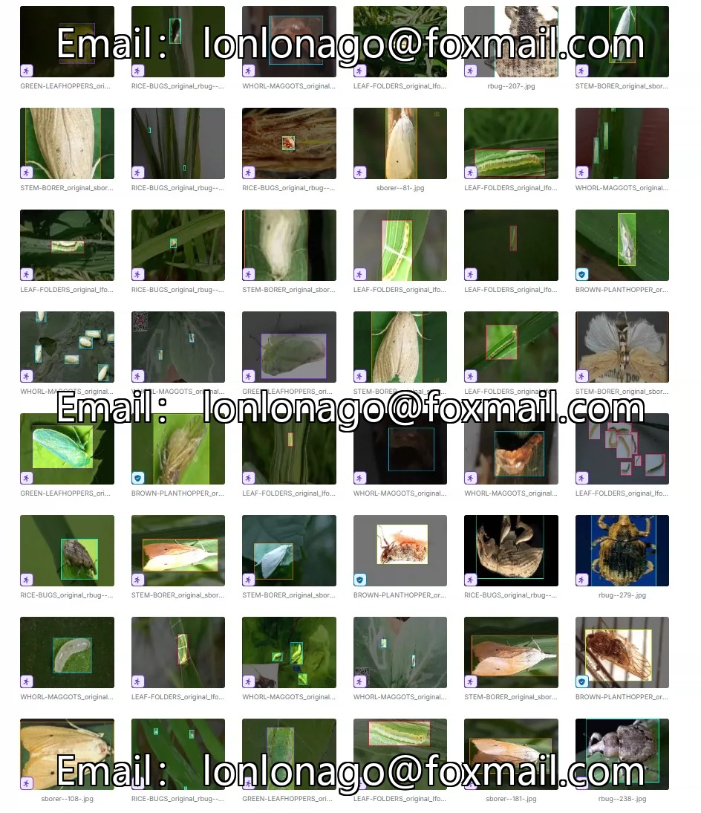
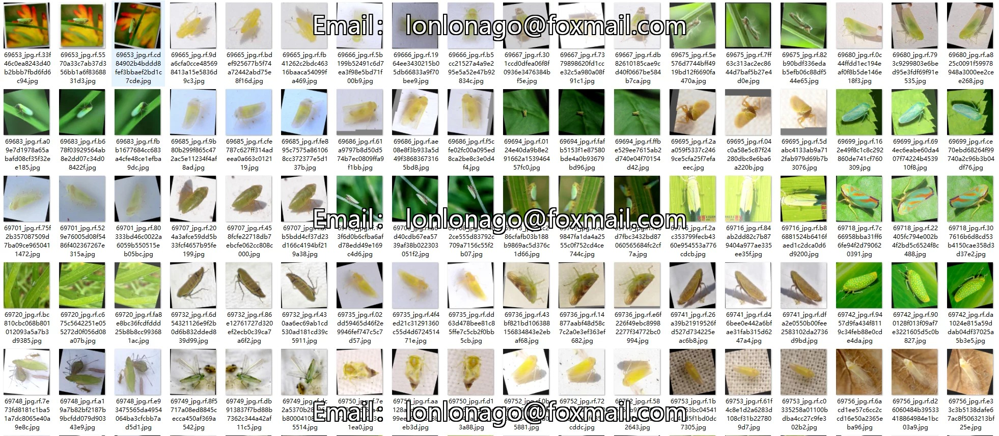
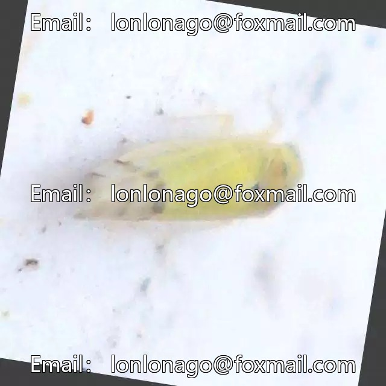
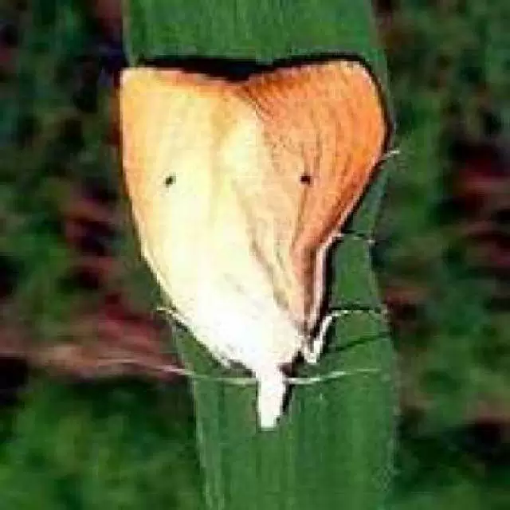

## Body

(Agricultural Products) Rice Pest and Disease Target Detection Dataset in YOLO format

Totally 31,278 images are available, all labeled with tags. There is only one training set.
The dataset is divided into 6 categories, namely 'brown-planthopper', 'green-leafhopper', 'leaf-folder', 'rice-bug', 'stem-borer', 'whorl-maggot'.
"Brown planthopper", "Green leafhopper", "Leaf folder", "Rice bug", "Stem borer", "Whorl maggot"

Electronic virtual products sold are not returnable.

## Images

item_1048544066360

Here is a pay link on Stripe ( https://buy.stripe.com/3cs8yP7sY87d0vu9AB ). Please contact me lonlonago@foxmail.com after funding $89, and I will send you a complete data files , thank you!

